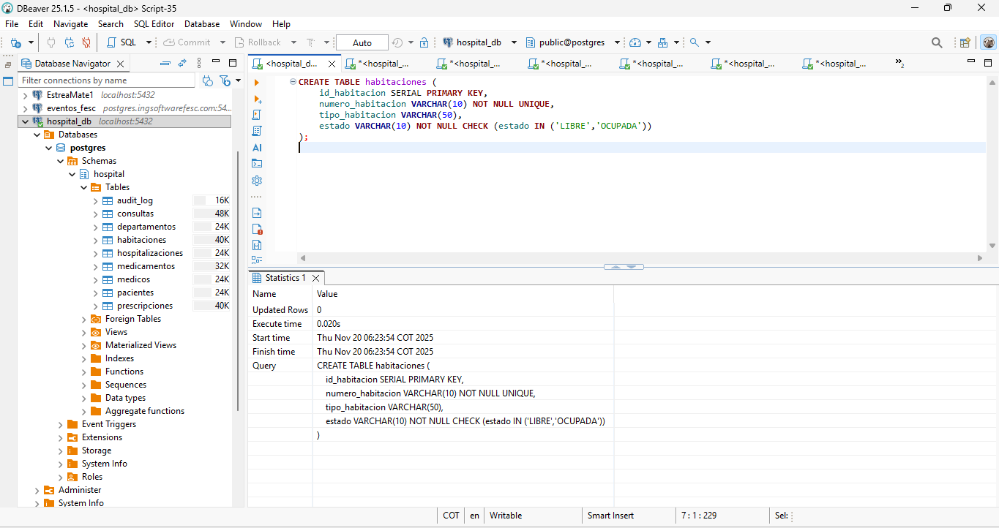
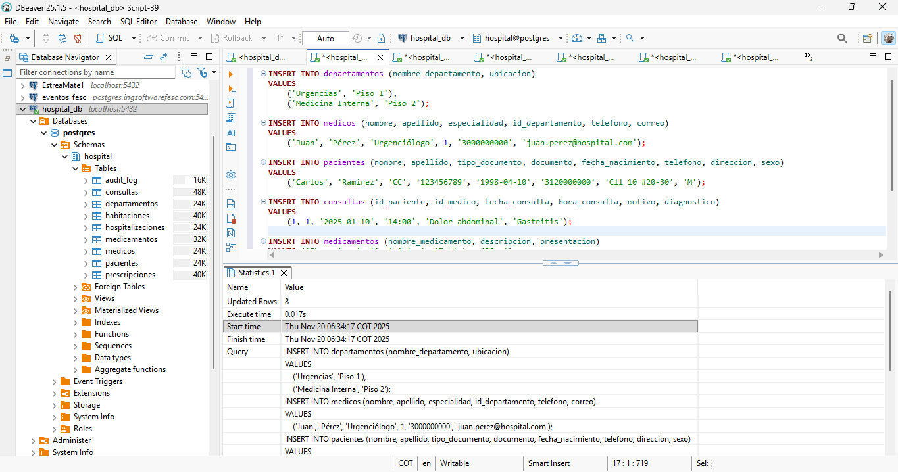
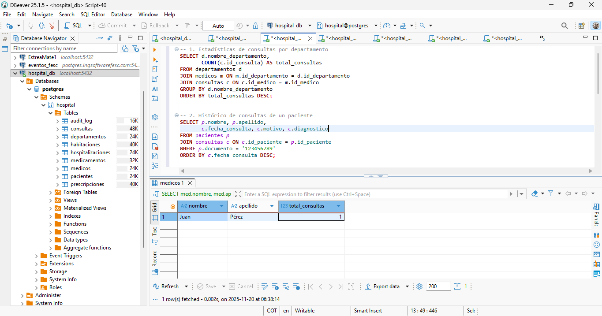
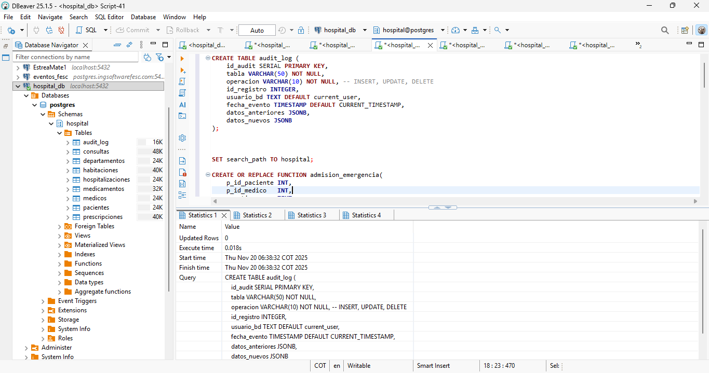
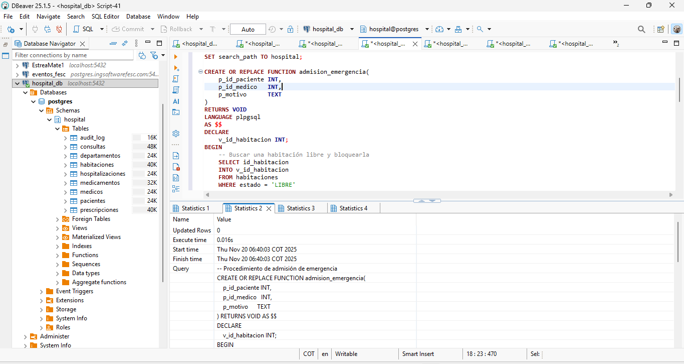
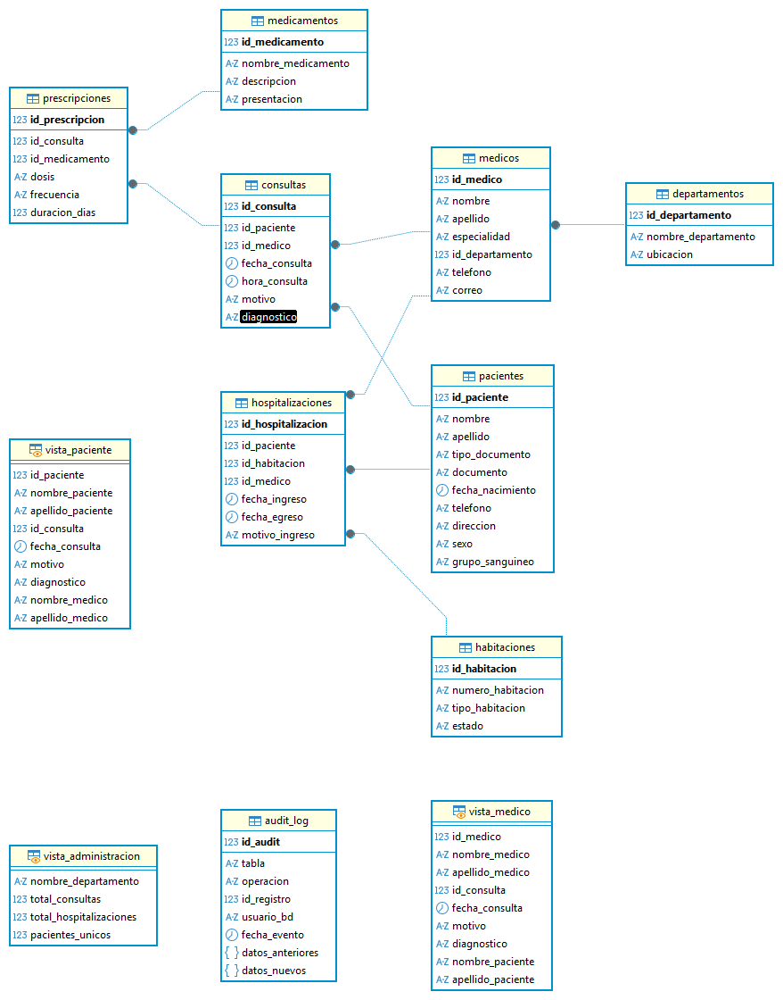

# 🏥 Sistema de Gestión Hospitalaria – PostgreSQL

**Autores:** Nelly Fabiola Cano Oviedo & Néstor Iván Granados Valenzuela

---

## 📌 Descripción

Proyecto académico que implementa un sistema completo de gestión hospitalaria usando **PostgreSQL 16**.
Incluye diseño relacional, normalización, transacciones ACID, auditoría, roles, vistas, RLS y optimización.

Este sistema administra:

* Pacientes
* Médicos
* Consultas
* Hospitalizaciones
* Habitaciones
* Medicamentos y prescripciones

---

## 🚀 Funcionalidades principales

* **Modelo relacional normalizado a 3FN**
* **Procedimiento de admisión de emergencia (ACID)**
* **Control de concurrencia con `FOR UPDATE SKIP LOCKED`**
* **Trigger de auditoría con JSONB**
* **Roles y permisos por actor (médico, paciente, enfermera, etc.)**
* **Row-Level Security (RLS)**
* **Vistas especializadas** según perfil de usuario
* **Índices estratégicos** para mejorar rendimiento

---

## 📂 Archivos del proyecto

```
├── Script_DDL_Hospital.sql
├── Consultas_Hospital.sql
├── Procedimientos_Hospital.sql
├── Seguridad_Hospital.sql
├── Vistas_Hospital.sql
├── Indices_Hospital.sql
└── Documentacion_Hospital.md
```

---

## Evidencias 








---

## 🛠️ Tecnologías utilizadas

* PostgreSQL 16
* PL/pgSQL
* JSONB
* pgAdmin / DBeaver

---

## 📜 Licencia

Proyecto académico — uso educativo.
